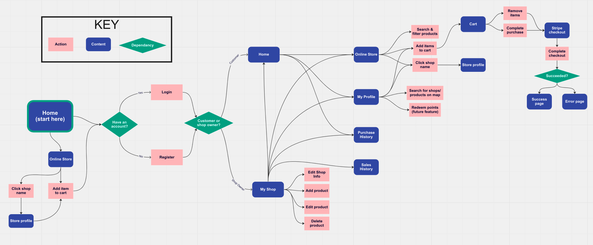
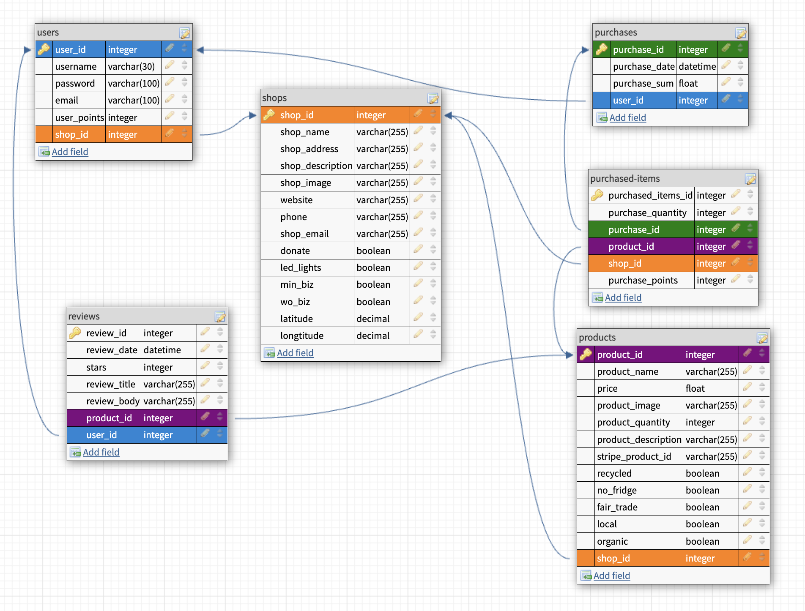

# Welcome to MSB.inc - My Shopping Buddy / My Sustainable Business
We are a marketplace app promoting local and sustainable shopping through gamification. 
- Our app is for customers interested in sustainability, who want a fun and rewarding way to shop locally and sustainably. 
- It is also for local small business owners interested in promoting sustainability, who are looking to connect to their local customer base and receive additional visibility/marketing exposure.

## User Flow Diagram
 

## Database Schema
 

## API Routes
See link below for API routes:
https://docs.google.com/document/d/1Imo2kaSTolhnP9axvekmA47TIhQiNZgiRTMcxA6obCM/edit?usp=sharing

## Setup

### Dependencies
In your terminal:
- navigate to the project directory and run `npm install`. This will install Express and other server-related dependencies.
- `cd client` and run `npm install`. This will install React client dependencies.

### Database

- Access the MySQL interface in your terminal by running `mysql -u root -p`
- Create a new database called msb: `CREATE DATABASE msb`
- Add a `.env` file to the project folder of this repository containing the MySQL authentication information for MySQL user. See below:
- Also include a secret key of your choice for authentication and authorization (login/register function). See below:

```bash
DB_HOST=localhost
DB_NAME=msb
DB_USER=root
DB_PASS=[your password]
SECRET_KEY=[your secret key]
```
- Run `npm run migrate` in the project folder of this repository, in a new terminal window. This will create tables 'users', 'shops', 'products', 'purchases', 'purchased-items', and 'reviews' in your database

### Folder for Image upload
- Create a new folder called 'productImg' in the Public folder(server side). This will allow you to upload images directly from your device.

### Run the app

1. In the server terminal, type `npm start` to start the server.
2. In the client terminal, type `npm start` to start the client.
3. Point your browser at `http://localhost:3000`.

## Technologies Used

- MySQL for data storage
- GitHub for version control
- Node JS & Express for back-end setup
- React for reactive front end
- React Router for more dynamic page navigation
- Visual Studio Code for all our coding!
- Bootstrap for easier styling
- JSONWebToken for token creation/authentication
- Bcrypt for encryption
- Postman to check route functionality
- Leaflet to display maps
- React Leaflet: To make Leaflet function more like react
- Multer for file upload in nodeJS
- React icons for icons
- Stripe for a payment gateway/checkout
- Nodemon is a utility that will monitor for any changes in your source and automatically restart your server
- Framer Motion is an open source, production-ready animation and gesture library for React

## Feature Extensions
- Shop addition leads to map marker addition (geocoding)
- Click on map to lead directly to shop profile/store
- Directions in map
- Pedometer integration
- Chat feature between shop and customer
- Direct redeemal of prizes won by customers
- Completion of edit product and edit shop profile features (click to highlight icons/points)

## Notes

For the powerpoint presentation: `https://docs.google.com/presentation/d/1flIQzhii_hKoPiScQVlcF2tdb3WEoy8oclfKF91masU/edit?usp=sharing`

 _This is a student project that was created at [CodeOp](http://codeop.tech), a full stack development bootcamp in Barcelona._


